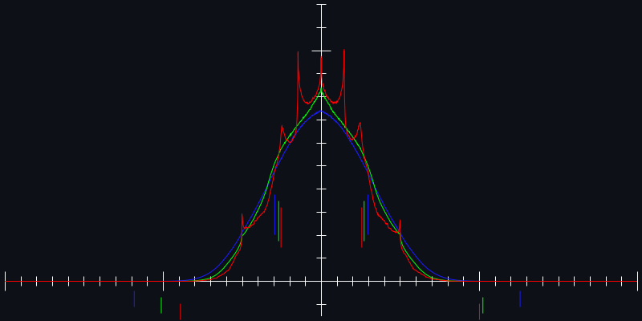
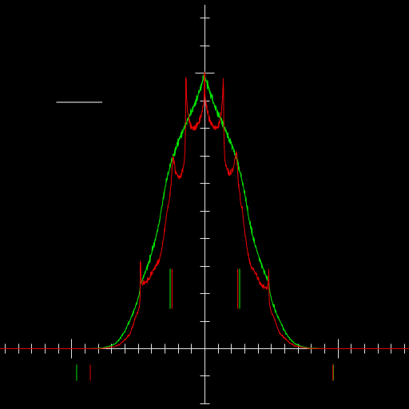
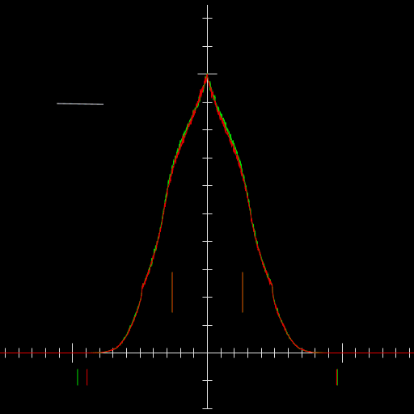
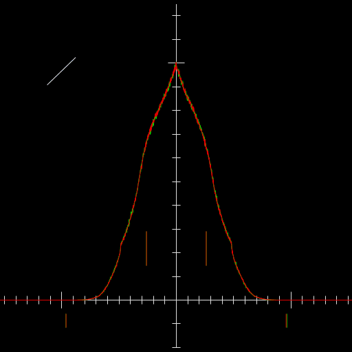
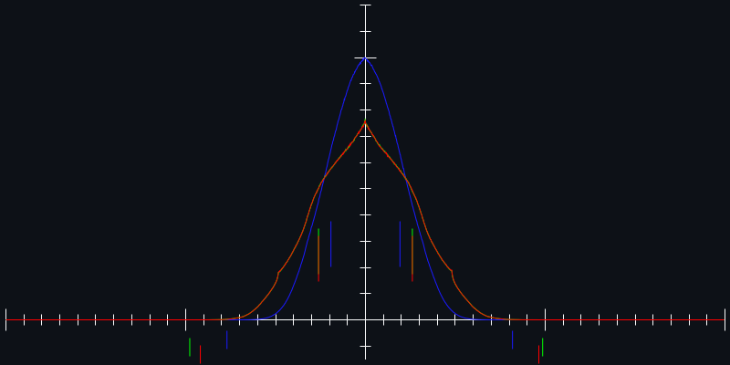
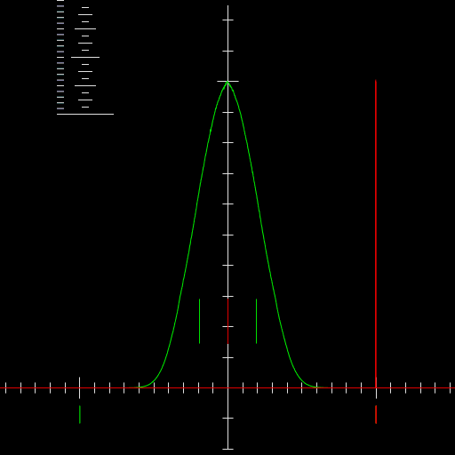
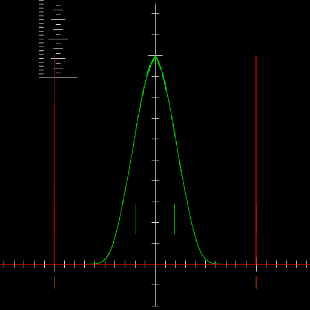
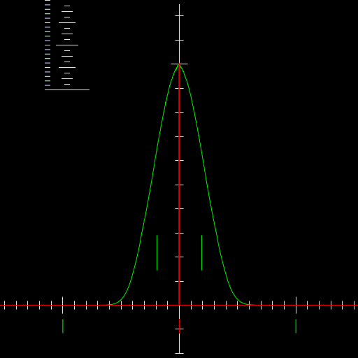
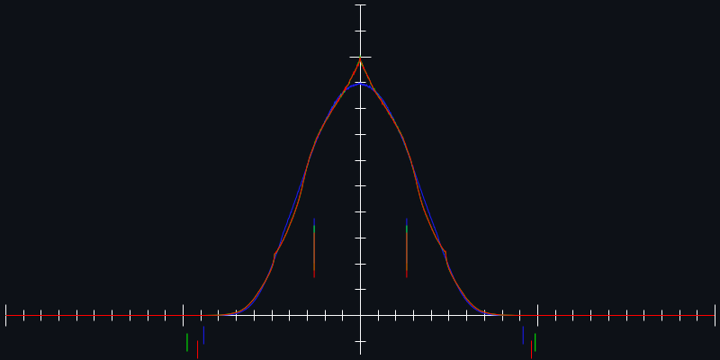

### output ranges/statistics of [improved perlin noise](https://mrl.cs.nyu.edu/~perlin/paper445.pdf)

based on code from 

* 2d : https://mrl.cs.nyu.edu/~perlin/noise/ImprovedNoise2D.java
* 3d : https://mrl.cs.nyu.edu/~perlin/noise/
* 4d : https://mrl.cs.nyu.edu/~perlin/noise/ImprovedNoise4D.java

tl;dr: use simplex, opensimplex, etc instead if possible.

tl;dr 2: 

* 2d noise implemented as a z=0 slice of 3d as above has a range of -1 to 1, but an ugly distribution

    Use a rotated slice of 3d noise, with same scale as normal 3d noise. Avoid angles within 5 or so degrees of a multiple of 45 degrees.
* 3d noise has a range of ±1.0363535 so scale it by 0.9649214285521897

    If you are using it for something that might end up taking slices at multiples of 0.5 on any axis (textureing an axis-aligned cube for example), you might want to rotate the input coordinates.
* 4d noise has a range of ±1.536354 so scale it by 0.6507949348645372.

    Like 3d, you might want to rotate coordinates if you might sample axis-aligned 2d slices.
* The distribution after scaling 4d noise is narrower, so you might want an option to expand it to match other noise types.

    `(* (signum x) (- 1 (expt (- 1 (abs x)) 1.464)))` gives a reasonable approximation of the 3d distribution.

#### unscaled output range

https://digitalfreepen.com/2017/06/20/range-perlin-noise.html calculates output ranges for general gradient noise, including original perlin noise, but that doesn't apply to improved perlin noise for 2 reasons:

* first, as noted in that link, it assumes unit length gradient vectors, and improved perlin noise uses non-unit vectors
* second, it assumes arbitrary gradient vectors, or at least gradient vectors that can point towards the center of the cell. Improved perlin noise uses gradient vectors with one element equal to 0, so it can't match the maximal configuration of general gradients (aside from the 2d code above, which seems to be 3d with Z = 0).

If we just take a bunch (100,000,000 for these tests, less for the animations) of samples and draw a histogram, we get:

Red is 2d, green is 3d, blue is 4d, bounds of samples are shown as lines below x-axis, std deviation show by lines inside graphs. Samples are between 0 to 256 on all axes.

From this we can see a few things:

* Just using 3d noise with z=0 for 2d gives us a pretty ugly looking distribution.
* 3d goes a bit outside the desired -1 to 1 bounds, and has a reasonable looking distribution
* 4d goes further outside -1 to 1 bounds, and is a flatter/wider distribution than 3d in general

##### fixing 2d

Without replacing the 2d algorithm completely, we can make some simple changes to get a better distribution, for example using a Z other than 0, or rotating the 3d samples away from the Z=0 plane.

Distributions with Z from 0 to 1:

Distributions rotated 0 to 360 degrees away from Z=0 plane

Both have some better and worse distributions, in particular Z=0.5 or angle=45,135,etc are worse than 0.

Rotations from -1 to 1:

Rotations from -44 to 46:

Most other rotations have a distribution similar to 3d noise, so we use 33 deg below.

##### fixing range of 3d and 4d

3d noise uses 12 possible gradients (with 4 of them repeated to simplify math), at 8 points per cell, giving us `12^8 = 429,981,696` possible combinations of gradients. This isn't too hard to search directly, and I found a maximum of `1.0363535` with single-floats.

For 4d noise, we have 32 gradients and 16 vertices, for 1,208,925,819,614,629,174,706,176 possible combinations, which is a bit harder to search exhaustively. With a bit of heuristics we can limit the search and still probably find a good bounds, I got `1.536354`.

Inverting these, we get scales of `0.9649218` and `0.65089166`. 
These match the double-float scales listed [here](https://www.reddit.com/r/proceduralgeneration/comments/ltfsd0/cricket_a_coherent_noise_generation_and/goyj3fe/) reasonably well, so using those we get the following:

That looks much better for avoiding errors from going out of bounds, or artifacts from clamping. Unfortunately, now 4d noise has a much narrower distribution, so we usually end up using much less of the expected range.

##### adjusting shape of distributions

If we want to use more of the output range while still staying within predictable bounds, `EXPT` is a reasonable candidate, since it maps 0 to 0, 1 to 1, and pushes in-between values towards one edge or the other depending on the exponent.

Unfortunately it doesn't cooperate very well with negative numbers, so we need to remap it a bit first.

If we just offset+scale the values to 0..1 range, we get the following (exponents from 0 to 2 in below images):

`(1- (* (expt (abs (* (1+ x) 0.5)) i) 2)) ;; X is input value, I is exponent`

That would probably be good if we wanted to adjust the brightness when generating an image, but not quite what we want here.

If we just take the absolute value, then add the sign back after `expt`, we get:

`(* (signum x) (expt (abs x) i))`

which is even worse, since it removes the center of the range, which should be the highest.

We don't have many values near 1, so we can reverse the 0 to 1 range, and do the above, then reverse it again, and we get something more useful:

`(* (signum x) (- 1 (expt (- 1 (abs x)) i)))`

After a bit of trial and error, an exponent of `1.464` gives a pretty good match with the the 3d histogram:

