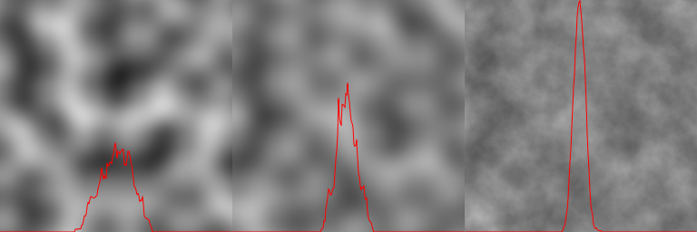
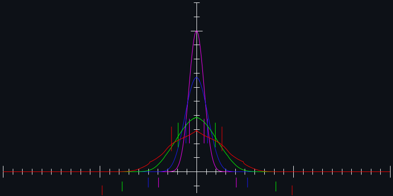
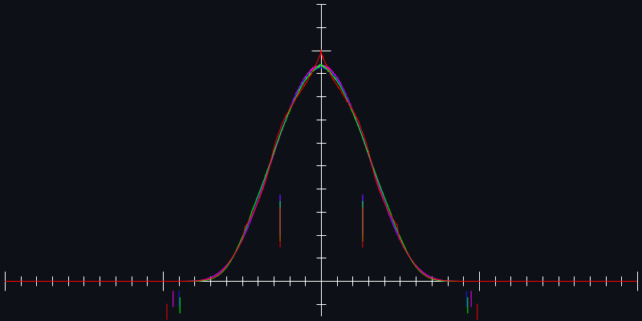
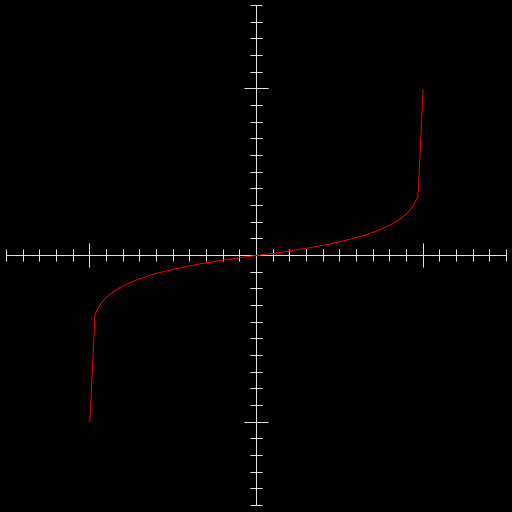
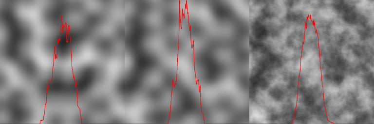
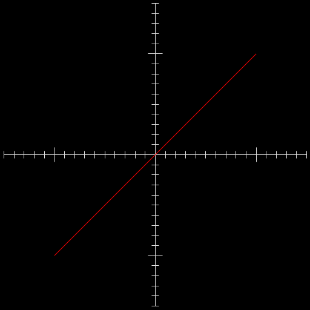
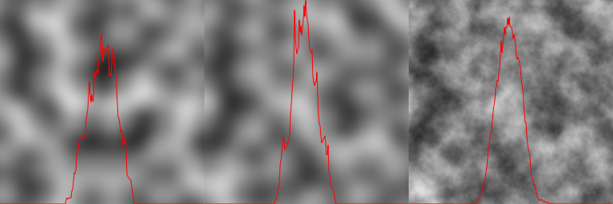
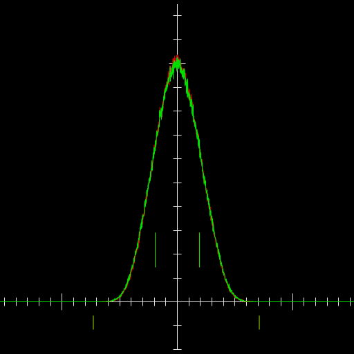

### reshaping noise distributions

Adding dimensions to gradient noise, or adding octaves to noise-based
[fBm](https://en.wikipedia.org/wiki/Fractional_Brownian_motion) both
tend to make the distributions of the result values narrower. In both
cases, reaching the extreme values requires all the intermediate
values to 'match' in some sense which becomes less likely when the
number of values increases.

3d noise, 4d noise, and fBm using 8 octaves of 4d noise:

Following images show examples of distributions of 3d noise (red), 4d
noise (green), 8 octaves of 4d noise with 0.5 gain (blue), and 8
octaces of 4d noise with 0.8 gain (magenta).

Scaled to [-1,1] range:

Scaled to [-1,1] range and reshaped to have same standard deviation:

#### reshaping functions

##### `expt` reshaping
First attempt was `(* (signum x) (- 1 (expt (- 1 (abs x)) K)))`, which does reaonably well but has slightly odd looking distribution when expanding a lot.

Graph of function from `1/8` to `16`:

`K=1.464` gives a reasonable reshaping for 4d noise to matchdistribution of 3d noise.

3d noise, 4d reshaped with `K=1.464`, fBm reshaped with `K=2.72`:

##### `polynomial` reshaping

[KdotJPG on reddit](https://www.reddit.com/r/proceduralgeneration/comments/m202at/fixing_perlin_improved_noise/gqn8056?utm_source=share&utm_medium=web2x&context=3)
suggests using `∫(1-x2)k dx`, and linearly interpolating between
integer `K` values (I just use a single `K` value, with `kBase` as integer part, and `kSlide` as fraction, since single value is nicer from user side).

This seems to work better, though it is a bit more effort to implement.

Graph of function from `0` to `32`

For large values of `K`, the polynomial generates fairly large range
of coefficients, so simple implementation starts needing double floats
around `K=18` or so.

Graph of function from `0` to `32` using single floats:

3d noise, 4d reshaped with `K=0.79`, fBm reshaped with `K=3.95` with polynomial:

##### comparison

Histograms showing how the 2 functions compare, reshaping a 4d noise
distribution from the original standard deviation of `0.19` to
`0.71`. Red is the `expt` function, green is the interpolated integral
polynomial function. Note how the red has a sort of `m` shaped
distribution starting around `0.4`, while green keeps the rounded peak
in the center until it starts running into the edges, and then still
keeps a more rounded distribution across the middle.

Actual results when applied to noise are fairly similar when just
drawn directly to an image, though might matter more when used as
heights or displacement where the continuity of the noise matters more.

4d noise reshaped from `0.19` to `0.71` using `expt` reshaping on left
and `polynomial` on right:

